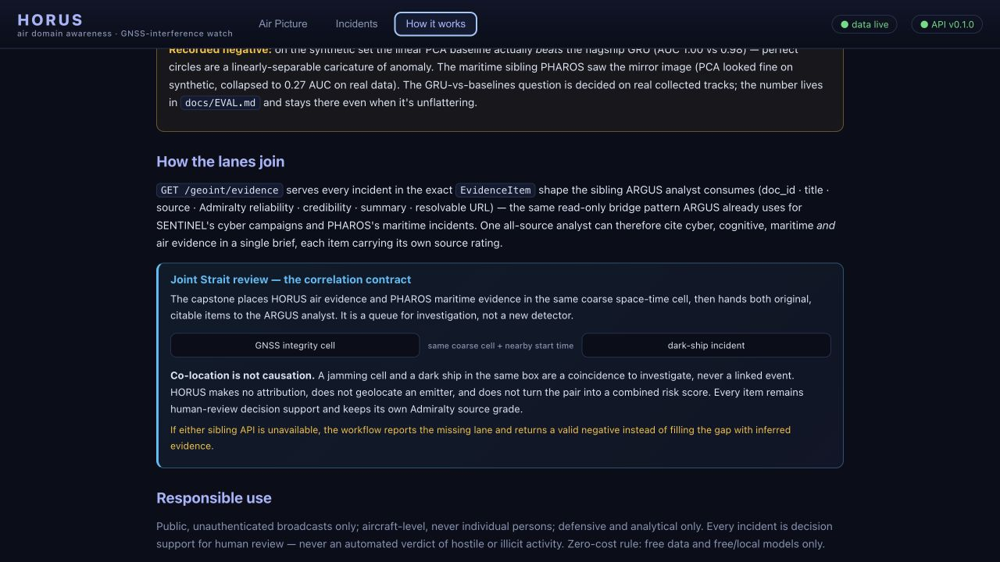
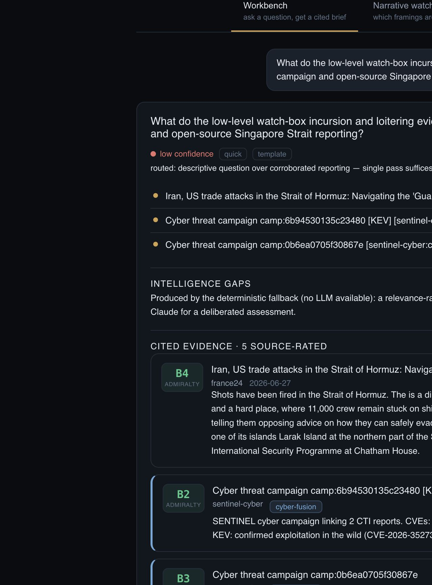
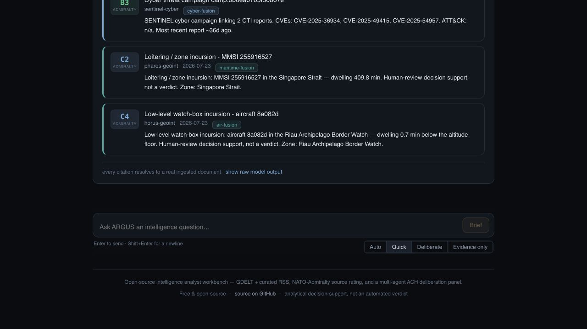

# Joint air + sea review

This is the portfolio capstone: a thin, read-only workflow over the evidence bridges that
already exist. HORUS and PHAROS each expose incidents in ARGUS's `EvidenceItem` shape;
`scripts/correlate_air_sea.py` places those independent items in the same coarse space-time
cell and hands the originals to an analyst. It creates no fused incident, identity link, or
new datastore.

> **Analytic contract:** co-location is not causation. The workflow makes no attribution,
> does not geolocate an emitter, and does not link an aircraft event to a vessel event. A
> jamming cell and a dark ship in the same box would be a coincidence to investigate, never
> a linked event. Every row is human-review triage only.



## Reproduce the joint table

Run each sibling over its local Singapore database:

```bash
# HORUS, from this repository
HORUS_DATABASE_URL=sqlite:///data/sg-live.db make api

# PHAROS, from ../pharos, on a different port
PHAROS_DATABASE_URL=sqlite:///data/sg-live.db \
  uvicorn pharos.api.app:app --host 127.0.0.1 --port 8001

# Back in HORUS
python -m scripts.correlate_air_sea \
  --horus-url http://127.0.0.1:8000 \
  --pharos-url http://127.0.0.1:8001
```

Defaults are deliberately legible rather than precise: the Singapore Strait analysis box,
0.5° latitude/longitude cells, and a three-hour start-time tolerance. The output shows time
separation and great-circle distance so the coarse abstraction stays visible. `--bounds`,
`--cell-deg`, and `--window-hours` make every assumption explicit.

Each API is fetched independently. If one is down, malformed, or returns no geolocated
evidence, the report marks that lane unavailable and returns a valid negative instead of
inferring the missing side.

## Live worked run — 25 July 2026

The run used the continuous local lanes after a fresh HORUS processing cycle:

| Lane | Endpoint | Rows received | Geolocated + timed |
|---|---|---:|---:|
| HORUS air | `127.0.0.1:8010/geoint/evidence` | 54 | 54 |
| PHAROS maritime | `127.0.0.1:8011/geoint/evidence` | 500 (endpoint cap) | 500 |

The rule returned **103 review pairs**. That count is not an event count or a threat metric:
one incident can pair with several incidents in a busy cell. The most time-adjacent pair was:

| Cell | Air evidence | Maritime evidence | Start separation | Distance |
|---|---|---|---:|---:|
| 1.0–1.5°N, 104.0–104.5°E | `incursion:8a082d:riau-border-watch` (C4) | `loiter-255916527-1784821370` (C2) | 39 s | 41.9 km |

The air item was a 0.7-minute low-level watch-box visit; the maritime item was a long
Singapore Strait loiter. The 41.9 km separation is the important result: these independent
detectors happened to fire in the same broad box and minute, but the pair supplies no
mechanism, attribution, or evidence that either caused the other. It earns an analyst look,
not a combined score.

## Worked ARGUS handoff

ARGUS was run locally against all four reachable lanes. This was intentionally the
deterministic, model-free evidence digest, not a deliberated assessment; it labelled itself
**low confidence** and preserved every lane's Admiralty grade.

| Lane | Cited item | Grade | What it contributes |
|---|---|---:|---|
| Cognitive / open source | `france24:0bf069d240349cd61e7b1caa` | B4 | A "Strait" retrieval hit about Hormuz, visibly wrong-region context and therefore a retrieval-noise warning, not Singapore evidence |
| Cyber | `sentinel-cyber:camp:6b94530135c23480` | B2 | A current KEV-backed SENTINEL campaign; proves the cyber bridge is reachable but supplies no link to the geospatial pair |
| Maritime | `pharos-geoint:loiter-255916527-1784821370` | C2 | The original PHAROS Singapore Strait loiter item |
| Air | `horus-geoint:incursion:8a082d:riau-border-watch` | C4 | The original HORUS low-level watch-box item |

This is a useful negative as well as a connectivity demonstration. Every lane can be cited,
but reachability is not relevance: the cyber campaign and wrong-strait open-source article
must not be used to manufacture an explanation for the air/sea coincidence. A real
assessment needs targeted Singapore reporting and corroboration outside the two public
broadcast feeds.

For the browser capture, ARGUS's geospatial bridges used read-only one-row views of the two
live sibling responses so the exact correlated pair survived the workbench's bounded
top-k context. The evidence rows were passed through unchanged. SENTINEL ran from its local
seed API; PHAROS and HORUS ran over their live local Singapore databases. No browser console
errors were present.



The bottom of the same brief shows the maritime and air cards side by side, each still
labelled as human-review support rather than a verdict:



## What this does not establish

- It does not measure causal association, coordinated activity, or gray-zone intent.
- It does not locate a jammer or identify an emitter.
- It does not turn zone membership into an airspace-violation claim.
- It does not make a clean Singapore lane evidence that the detector always works; the
  separate positive/negative control evaluation remains the flagship validation.
- It does not keep PHAROS or ARGUS online as new production dependencies. The script is an
  analyst recipe and degrades gracefully when a sibling is unavailable.
